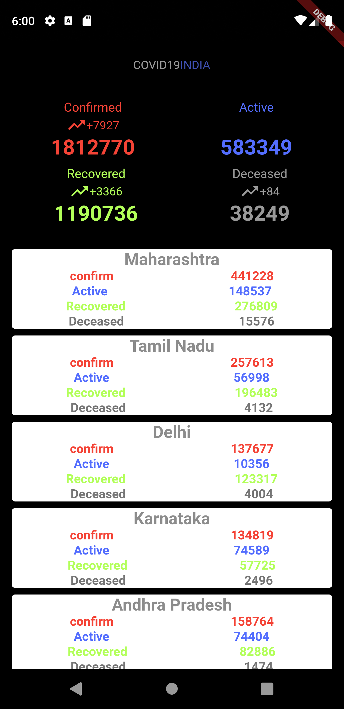
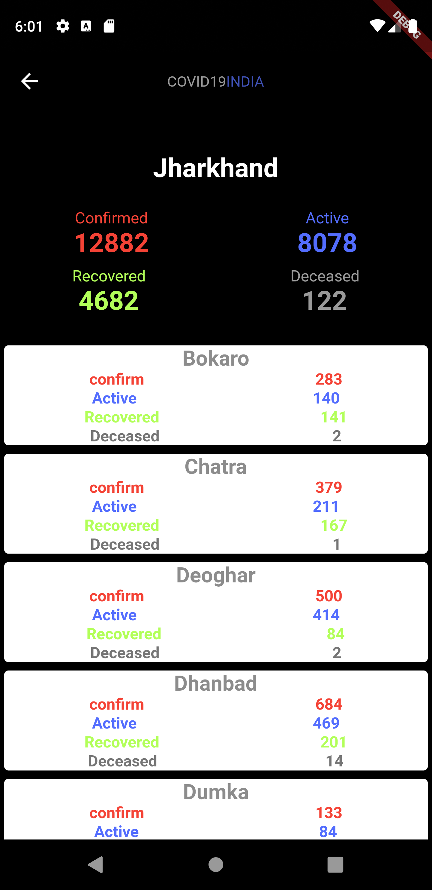

# covid19_india
<h3>
Its a simple covid19 tracker which shows data state and district wise
</h3>
<h2>
Technology Used :
</h2>
<h3>
<ul><li>Flutter</li><li>covid19india.org api</li></ul>
</h3>

<h1>Images:</h1>

<h2>State Wise</h2>

<h2>District Wise</h2>

